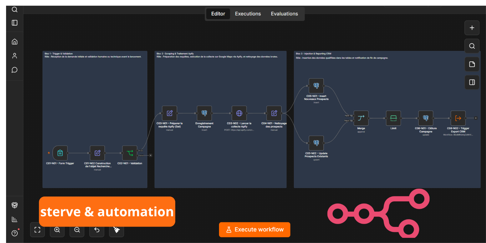
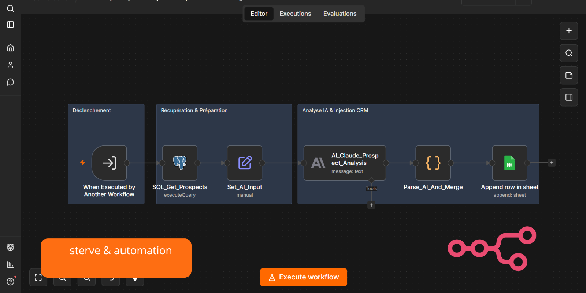
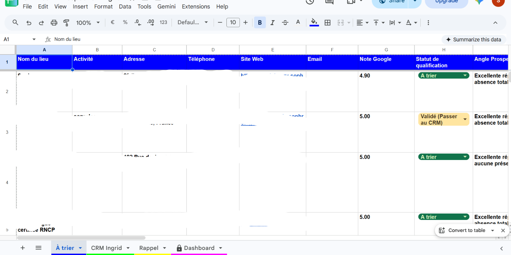

# CRM Prospection SMM

Système d'automatisation de prospection pour une **Social Media Manager (SMM)** indépendante : collecte de leads depuis Google Maps, stockage structuré, enrichissement par IA générative, restitution dans un tableur de suivi.

Projet réel, entièrement documenté selon la **méthode d'architecture de systèmes IA en 13 étapes**.

**L'IA propose. L'humain décide.**

---

## Le résultat en une ligne

**Avant :** ~2 h par jour de prospection manuelle, **59 prospects** accumulés dans un fichier, **0 conversion**.
**Avec le système :** une recherche lancée en **~2 minutes**, puis des prospects collectés, dédoublonnés et enrichis automatiquement (angle d'approche + accroche + score). La SMM n'a plus qu'à qualifier et contacter.

| | Avant | Avec le système |
|---|---|---|
| Temps de prospection | ~2 h / jour, manuel | ~2 min pour lancer, puis qualification seule |
| Prospects exploitables | 59 accumulés, non qualifiés | collectés, dédoublonnés, enrichis |
| Conversion | 0 | la matière commerciale existe enfin |
| Coût par prospect qualifié | — | **~0,10 €** mesuré (Apify ~0,09 $ + Claude ~0,01 $) |

<sub>* Coût réel mesuré (septembre 2026, config avec extraction des contacts) : ~0,09 $/prospect côté Apify + ~0,01 $/prospect côté Claude Sonnet. Une campagne de 50 prospects revient à ~5 €, soit **~0,10 € le lead prêt à contacter** — là où la même collecte à la main mobilise ~2 h/jour.</sub>


---

## Aperçu visuel

Le système est porté par **2 workflows n8n** liés, chacun structuré en 3 blocs fonctionnels.

### Workflow 1 — Lead Generation & Apify

Collecte les prospects depuis Google Maps via Apify, normalise les données, stocke en base (3 tables : campagnes, collectes, prospects), puis déclenche le Workflow 2.



### Workflow 2 — AI Analysis & Export

Récupère les prospects de la campagne, enrichit chacun via Claude (angle d'approche, accroche personnalisée, score de priorité), puis injecte le résultat dans le tableur de suivi.



### Restitution — Onglet "À trier"

Chaque prospect enrichi arrive dans l'onglet "À trier" du Google Sheet. La SMM lit, qualifie, décide. Aucune décision commerciale n'est automatisée.



---

## Ce que fait le système

1. La SMM lance une prospection via un formulaire (métier, zone, limite).
2. Le système collecte les lieux correspondants sur Google Maps.
3. Les données sont normalisées et stockées en base relationnelle.
4. L'IA analyse chaque prospect et propose un angle, une accroche, un score.
5. Le résultat est livré dans le tableur, prêt à être qualifié manuellement.

---

## Robustesse — que se passe-t-il quand ça casse ?

- **Apify renvoie du vide ou un nombre de résultats incohérent** → un *contrat d'appariement* lève une erreur plutôt que de risquer d'attribuer l'email d'une entreprise à une autre. Les appels de collecte sont réessayés (jusqu'à 3 fois) et un workflow d'erreur dédié prend le relais.
- **Le format de Google Maps change** → le mapping vérifie chaque champ (LinkedIn uniquement sur une page `/company/`, email pris dans `emails[]` sinon dans le profil Facebook vérifié) et journalise ce qui a été rejeté : un faux négatif reste visible au lieu de disparaître derrière un `0`.
- **Un prospect fait échouer l'analyse IA** → le lot continue sans s'interrompre ; le prospect problématique est isolé, pas perdu.

## Stack technique

| Rôle | Technologie |
|---|---|
| Orchestration | n8n (self-hosted) |
| Base de données | Supabase (Postgres managé) |
| Collecte | Apify (Google Maps Scraper) |
| IA générative | Anthropic Claude Sonnet |
| Restitution | Google Sheets (Service Account) |

---

## Structure du dépôt

```
crm-prospection-smm/
├── assets/                    # Captures visuelles des workflows et du Sheet
│   ├── workflow-1-lead-generation.png
│   ├── workflow-2-ai-analysis.png
│   └── google-sheet-preview.png
├── docs/
│   └── methode/               # Documentation standardisée en 13 étapes
├── workflows/                 # Exports JSON n8n (credentials à reconfigurer)
│   ├── workflow-1-lead-generation.json
│   └── workflow-2-ai-analysis-export.json
├── .gitignore
└── README.md
```

---

## Documentation — Méthode en 13 étapes

La documentation complète est dans `docs/methode/`. Chaque fichier a un périmètre strict, sans débordement sur les autres.

| # | Fichier | Contenu |
|---|---|---|
| 01 | Besoin_Client | Le besoin exprimé par l'utilisatrice |
| 02 | Probleme_Metier | Le problème chiffré à résoudre |
| 03 | Objets_Metier | Les objets du domaine |
| 04 | Objet_Central | Le pivot du modèle (Prospect) |
| 05 | Cycle_de_Vie | États et transitions de l'objet central |
| 06 | Composants | Décomposition en blocs des workflows |
| 07 | Contrats | Données circulant entre les blocs |
| 08 | Architecture | Vue d'ensemble du système |
| 09 | Choix_Technos | Technologies retenues et leurs rôles |
| 10 | Justifications | Décisions, arbitrages, dette technique |
| 11 | Plan_Implementation | Ordre d'assemblage et jalons |
| 12 | Strategie_Tests | Validation du système |
| 13 | Documentation | Organisation de la doc |

Ordre de lecture recommandé : de `01` à `13`.

---

## Réutiliser ce projet

1. **Base de données** : créer les 3 tables (campagnes, collectes, prospects). Schéma décrit dans `docs/methode/07.Contrats.md` et `08.Architecture.md`.
2. **Importer les workflows** : dans votre instance n8n, importer les 2 JSON du dossier `workflows/`.
3. **Configurer les credentials** : Apify, Postgres, Anthropic, Google Sheets.
4. **Relier les workflows** : dans le nœud Execute Workflow du Workflow 1, pointer vers l'ID de votre Workflow 2 importé.
5. **Activer** : ouvrir le formulaire du Form Trigger et lancer une première prospection.

---

*Projet construit et documenté selon la méthode d'architecture de systèmes IA en 13 étapes.*
